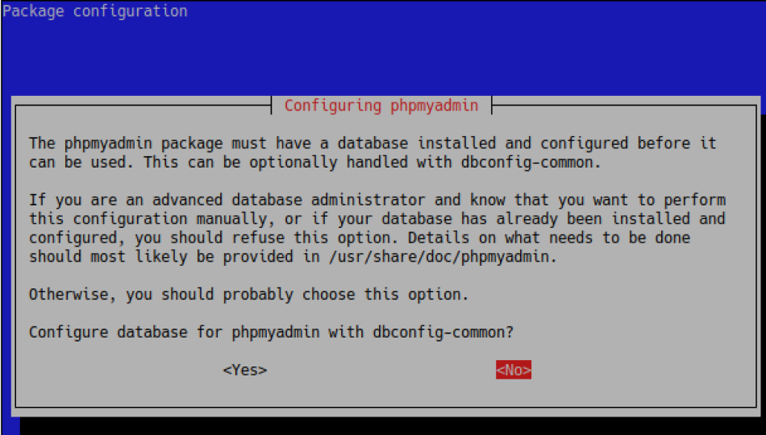
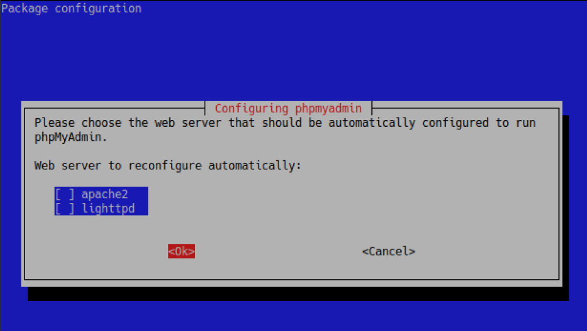
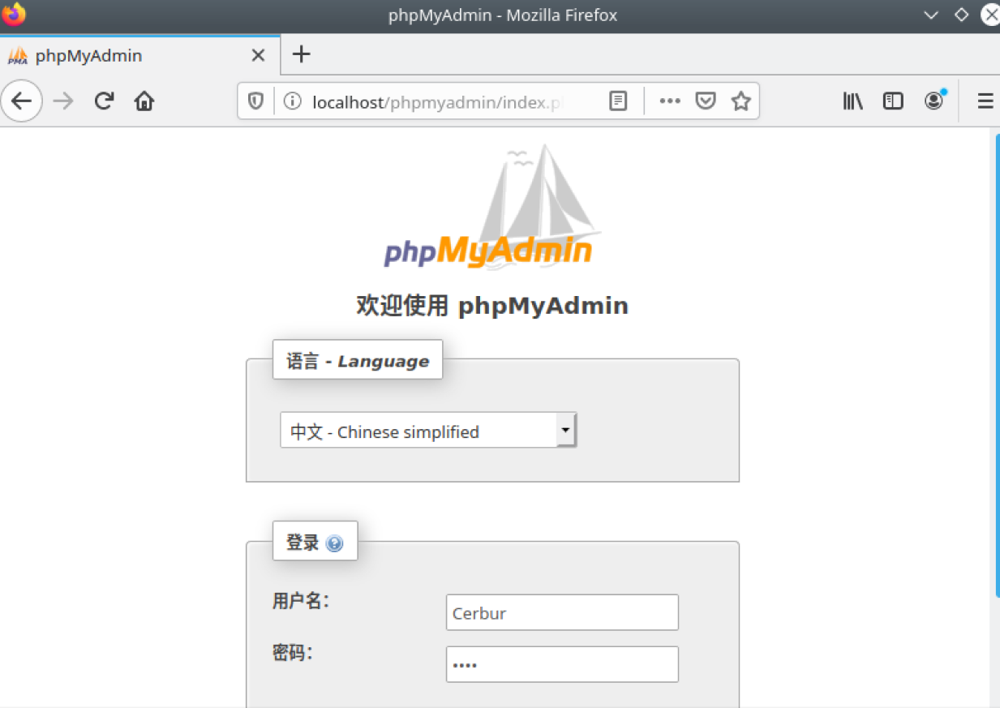

这是一个后台介绍和数据库介绍和LNMP环境搭建的教程


# 什么是后台
要说什么是后台？我们得知道什么是前台。  

前台？这个词就很像我们去酒店，去KTV的时候的那个前台。我们和前台人员交涉，开什么房，开到几点，如何就只管住、唱了，我们面对交流这个就是前台。而且应用开发的时候呢？用户面对的，交互的就是前台。比如我们所看到的一个网页、APP、游戏客户端，这些都是前台。  

那后台呢？再回到我们的比喻，住酒店、KTV。在你看不到的地方，是由工作人员把这个房间收拾好，把KTV里面的设备启动打开。这些是我们看不到的，是你开了房间后工作人员去做的。对于应用开发就是用户看不到的地方，对事件进行处理，包括不限于数据处理(虽然什么东西都可以说是数据)。  
好啦，我们现在就知道了，后台就是那群默默工作的人，有了后台，用户的数据可以实现存储读取。  

这下面这附图说明前台后台的联系方式，其中的apache服务对应的就是我们之后用的nginx。我们要做的就是编写程序实现对数据进行处理，访问数据库获得所需的信息，返回资源给前台。  
>  
*引用图片知乎用户[@科普小民工](https://www.zhihu.com/people/peng-bai-bai-7/activities)*  
>  
我们以百度为例子，百度搜索中，搜索框中输入搜索内容①，点击搜索②，获得搜索结果③。我们进行操作，也就是和前端的操作是①②两步，③是页面展示的。在③的过程细分是这样的，服务器获取到用户提交的搜索内容，服务器在数据库查询得到搜索内容的结果，服务器将搜索结果的资源返回给浏览器，浏览器显示页面。后台的工作便是如何让服务器实现对应的业务处理。  

以上  
# 数据库简介  
数据库(database)说白了就是用来存数据的，是按照数据结构来组织、存储和管理数据的仓库。那么就有人问了为什么存数据要用数据库，在大家长这么大以来，普遍用来存数据的差不多就是excel了。其实excel和数据库是很像的，但为什么要用数据库呢？因为它被设计出来的时候就是为了给机器更高效的存取信息，而excel是为了给人存取。  

而数据库又分为了关系型数据库(Relational Database)和非关系型数据库(Not Only SQL)。
## 关系型数据库
什么是关系型数据库呢？举个例子，当我们要存协会成员的信息的时候，至少要存个姓名、班级、学号、部门这些信息吧。而这些信息是互相关联的，所以在我们用excel存协会成员信息的时候，会选择使用excel中的一行来做列名，一列的信息是同一类信息，一行是同一个人的信息，当表格与表格间还有联系时，这就构成了一个关系型数据库。这种表格在数据库中被称作**数据表**，列名在数据库中被称为**字段**，每一个表都有他对应的名字被叫做**表名**
  

# 非关系型数据库
至于非关系型数据库就很故名思意了，通常来说为没有各种字段的联系，一个键(Key)和一个值(Value)，构成一个键值对来存储，比方说**昏睡红茶(key)-子曦(Value) Cerbur(key)-帅(Value)**，只是键和值有联系其他之间没有联系，这就是非关系型数据库。  

# SQL
**SQL**(Structured Query Language)结构化查询语言，他是一种 ANSI(American National Standards Institute 美国国家标准化组织)标准的计算机语言，用于访问和处理数据库。数据库听不懂人话，所以我们需要用一门他能听懂的语言命令他执行对应的操作。

## 几个关系型数据库

### MySQL(商业版，社区版免费开源)
> 原本是一个开放源码的关系数据库管理系统，原开发者为瑞典的MySQL AB公司，该公司于2008年被昇阳微系统（Sun Microsystems）收购。2009年，甲骨文公司（Oracle）收购昇阳微系统公司，MySQL成为Oracle旗下产品。  
MySQL在过去由于性能高、成本低、可靠性好，已经成为最流行的开源数据库，因此被广泛地应用在Internet上的中小型网站中。随着MySQL的不断成熟，它也逐渐用于更多大规模网站和应用，比如维基百科、Google和Facebook等网站。非常流行的开源软件组合LAMP中的“M”指的就是MySQL。  
但被甲骨文公司收购后，Oracle大幅调涨MySQL商业版的售价，且甲骨文公司不再支持另一个自由软件项目OpenSolaris的发展，因此导致自由软件社群们对于Oracle是否还会持续支持MySQL社群版（MySQL之中唯一的免费版本）有所隐忧，MySQL的创始人麦克尔·维德纽斯以MySQL为基础，成立分支计划MariaDB。而原先一些使用MySQL的开源软件逐渐转向MariaDB或其它的数据库。
>
*引用[中文维基MySQL词条](https://zh.wikipedia.org/wiki/MySQL)*
### MariaDB(免费开源)
>MariaDB是MySQL关系数据库管理系统的一个复刻，由社区开发，有商业支持，旨在继续保持在GNU GPL下开源。MariaDB的开发是由MySQL的一些原始开发者领导的，他们担心甲骨文公司收购MySQL后会有一些隐患。  
MariaDB打算保持与MySQL的高度兼容性，确保具有库二进制奇偶校验的直接替换功能，以及与MySQL API和命令的精确匹配。  
 MariaDB自带了一个新的存储引擎Aria，它可以替代MyISAM，成为默认的事务和非事务引擎。它最初使用XtraDB作为默认存储引擎，并从10.2版本切换回InnoDB。  
它的首席开发人员是米卡埃尔·维德纽斯，他是MySQL AB的创始人之一，也是Monty Program AB的创始人。2008年1月16日，MySQL AB 宣布它已经同意被太阳微系统集团以大约10亿美元的价格收购。该项收购已于2008年2月26日完成。MariaDB是以Monty的小女儿Maria命名的，就像MySQL是以他另一个女儿My命名的一样。
>
*引用[中文维基MariaDB词条](https://zh.wikipedia.org/wiki/MariaDB)*  
### Oracle数据库(收费，可以不看 )
>Oracle Database，又名Oracle RDBMS，或简称Oracle。是甲骨文公司的一款关系数据库管理系统。到当前仍在数据库市场上占有主要份额。  
劳伦斯·埃里森和他的朋友，之前的同事Bob Miner和Ed Oates在1977年创建了软件开发实验室咨询公司（SDL，Software Development Laboratories）。SDL开发了Oracle软件的最初版本。Oracle的名称来自于埃里森在Ampex工作时参加的一个由中央情报局创建的项目的代码名称。
>

## 几个非关系型数据库
### Redis(开源)
>Redis是一个使用ANSI C编写的开源、支持网络、基于内存、可选持久性的键值对存储数据库。从2015年6月开始，Redis的开发由Redis Labs赞助，而2013年5月至2015年6月期间，其开发由Pivotal赞助。在2013年5月之前，其开发由VMware赞助。根据月度排行网站DB-Engines.com的数据，Redis是最流行的键值对存储数据库。
>
*引用[中文维基Redis词条](https://zh.wikipedia.org/wiki/Redis)*  
### MongoDB
>MongoDB是一种面向文档的数据库管理系统，用C++等语言撰写而成，以此来解决应用程序开发社区中的大量现实问题。2007年10月，MongoDB由10gen团队所发展。2009年2月首度推出。
>
*引用[中文维基MongoDB词条](https://zh.wikipedia.org/wiki/MongoDB)*  

# 后台语言
目前主流的后台语言有Java，PHP，C++，Golang，Python。排名分先后。就要就是处理客户端的TCP/UDP请求，操作数据库，在后台任务中是一个中间层的角色。  
这里我们重点讲一下PHP
## PHP
>PHP（全称：PHP：Hypertext Preprocessor，即“PHP：超文本预处理器”）是一种开源的通用计算机脚本语言，尤其适用于网络开发并可嵌入HTML中使用。PHP的语法借鉴吸收C语言、Java和Perl等流行计算机语言的特点，易于一般程序员学习。PHP的主要目标是允许网络开发人员快速编写动态页面，但PHP也被用于其他很多领域。  
PHP最初是由勒多夫在1995年开始开发的；现在PHP的标准由the PHP Group[2]维护。PHP以PHP License作为许可协议，不过因为这个协议限制了PHP名称的使用，所以和开放源代码许可协议GPL不兼容。  
PHP的应用范围相当广泛，尤其是在网页程序的开发上。一般来说PHP大多运行在网页服务器上，透过运行PHP代码来产生用户浏览的网页。PHP可以在多数的服务器和操作系统上运行，而且使用PHP完全是免费的。根据2013年4月的统计数据，PHP已经被安装在超过2亿4400万个网站和210万台服务器上。
>
*引用[中文维基PHP词条](https://zh.wikipedia.org/wiki/PHP)*   
为什么我们选择使用PHP，首先，PHP简单易上手，他比C语言简单，是一个脚本动态类型语言。没有那么多C语言要求的规范。其次，他的函数库非常丰富。~~是一个非常适合面向搜索引擎开发的语言。~~ 他操作数据库相当简单。PHP还是一个典型的面向对象编程(Object-oriented programming)的语言，之后学习其他oop类型的语言就相对简单了。最后他可以完全嵌入HTML代码，对于新手开发网站，PHP是世界上最好的语言。~~PHP is the best language for web programming.~~

# 环境搭建
## LNMP - Linux + Nginx + MySQL/MariaDB + PHP  
关于MySQL/MariaDB，在前期SQL语法上，和客户端使用上，基本没有区别。后期可能会有区别，基于尽量使用开源产品的原则，我们选择使用MariaDB，你平时叫他MySQL没人说你啥的。  

让我们开始吧

```bash
$ sudo apt-get update
# 更新源
```

### Nginx
```bash
 sudo apt install nginx
# 昨天安装过的可以跳过了
```

### MariaDB
```bash
 sudo apt install mariadb-server -y
```

### PHP7.2
```bash
 sudo apt install php7.2 php7.2-common php7.2-mysql php7.2-mbstring php7.2-fpm php7.2-cgi php7.2-common php-pear php-gettext -y
```

### 启动各服务
```bash
 sudo systemctl start nginx
 sudo systemctl start mariadb
 sudo systemctl enable nginx
 sudo systemctl enable mariadb
```

### 配置MySQL/MariaDB
```sql
$ sudo mysql
-- 我们将进去MySQL/MariaDB客户端
-- 创建我们的用户
MariaDB [(none)]> CREATE USER 'username'@'localhost' IDENTIFIED BY 'password';
-- 给我们的用户赋予最高权限
MariaDB [(none)]> GRANT ALL PRIVILEGES ON *.* TO 'username'@'localhost' WITH GRANT OPTION;
-- 退出MySQL客户端
MariaDB [(none)]> exit
-- 用我们所创建的用户登录客户端,这里的-u是user的意思,后面跟着username,-p是密码的意思,这样输入回车后可以隐藏式输入密码更安全
$ sudo mysql -u username -p
```
这里算是MySQL配置配置完成了，现在我们执行下MySQL中的Hello World ~~drop databases~~   
```sql
MariaDB [(none)]> show databases;
+--------------------+
| Database           |
+--------------------+
| information_schema |
| mysql              |
| performance_schema |
+--------------------+
3 rows in set (0.00 sec)
```
MySQL配置完成  
### 安装phpmyadmin  
虽然后台开发很崇尚使用终端，但是数据库查看的时候，难免会觉得终端没那么方便，所以我们选择使用图形化界面来查看和管理，我们这里选择使用基于php开发的允许在Web上的图形化工具phpmyadmin  
```bash
 sudo apt-get install phpmyadmin -y
```
安装过程中会弹出
  
选择No  

  
用Tab直接选择Ok

安装完成后使用以下指令，将phpmyadmin的文件移动至nginx存放html页面的文件夹。
```bash
 sudo mv /usr/share/phpmyadmin /var/www/html
```
编写nginx转发phpmyadmin的配置文件
```
sudo vi /etc/nginx/sites-available/phpmyadmin.conf
# 复制以下内容在此文件中

server {
        listen 80 default_server;
        listen [::]:80 default_server;
        root /var/www/html;

        # Add index.php to the list if you are using PHP
        index index.php index.html index.htm index.nginx-debian.html;

        server_name localhost;

        location ~ \.php$ {
           include snippets/fastcgi-php.conf;
           fastcgi_pass unix:/var/run/php/php7.2-fpm.sock;
           fastcgi_param SCRIPT_FILENAME  
           $document_root$fastcgi_script_name;
           include fastcgi_params;
       }
}
```
```bash
$ sudo nginx -t
# 检查nginx配置文件
nginx: the configuration file /etc/nginx/nginx.conf syntax is ok
nginx: configuration file /etc/nginx/nginx.conf test is successful

# 执行以下命令
$ sudo rm -rf /etc/nginx/sites-enabled/default
$ sudo ln -s /etc/nginx/sites-available/phpmyadmin.conf /etc/nginx/sites-enabled/

# 配置文件无异常
$ sudo systemctl restart nginx
```
至此所有环境配置完成  
打开你的浏览器，在地址栏输入```http://localhost/phpmyadmin```进入phpmyadminn界面，在language一栏选择我们最喜欢的中文简体，输入我们之前创建的用户名和密码，点击执行
  

好了我们现在进入了完整的phpmyadmin图形化界面了  

LNMP全部环境搭建完成  
下面就需要你们自己好好学习了

# 参考资料
[PHP中文手册](https://www.php.net/manual/zh/)  
[MySQL文档](https://dev.mysql.com/doc/)  
[phpmyadmin文档](https://www.phpmyadmin.net/docs/)  
[英文原版的环境搭建教程](https://www.howtoforge.com/tutorial/how-to-install-phpmyadmin-with-nginx-on-ubuntu-1804/)  
[w3cschool的mariadb教程](https://www.w3cschool.cn/mariadb/)  
[w3cschool的MySQL教程](https://www.w3cschool.cn/mysql/)  
[w3cschool的php教程](https://www.w3school.com.cn/php/index.asp)
